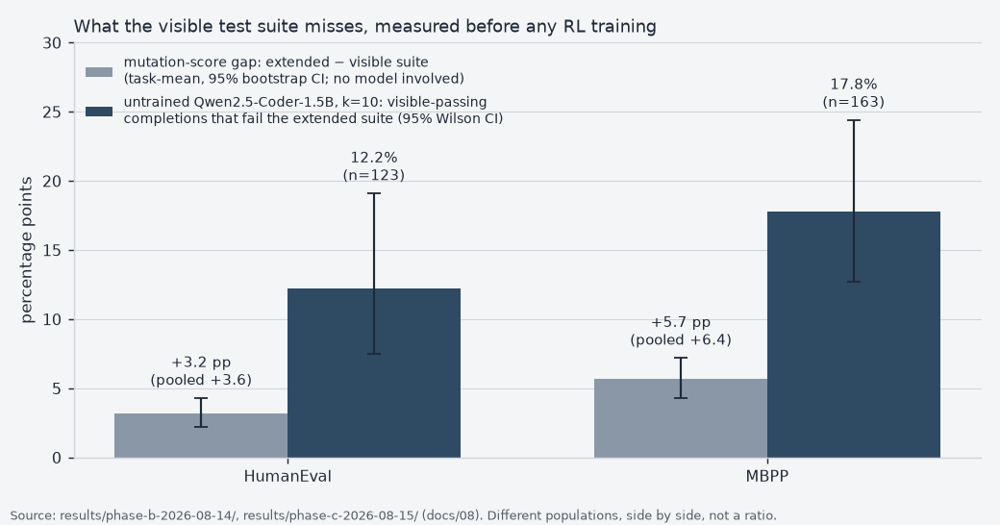

# rlvr-codegen


-3f5f7f)


> **Public snapshot (refreshed 2026-09-04).** Sanitized snapshot of the working repo: the private
> build-harness submodule (`harness/`) is removed, and `data/e-corpus/tasks.jsonl` and
> `data/e-corpus/reports/*.json` have titles/notes redacted for tasks mined from private
> production repos (task shapes, verification evidence and all HumanEval/MBPP results are intact).


A learning-driven project: train a small code model with **reinforcement learning from
verifiable rewards (RLVR)**, where the reward is "do the unit tests pass," and study the
one question that makes or breaks the whole idea: does the model *learn to write correct
code*, or does it just *learn to pass the visible tests*?

**The case with receipts (frozen write-up): [`SHOWCASE.md`](SHOWCASE.md).**

This repo is two things at once:

1. **A build project** toward a rigorous, reproducible RLVR result (live plan:
   [`docs/07-rescope-verifier-adequacy.md`](docs/07-rescope-verifier-adequacy.md)).
2. **A set of from-scratch notes** on the concepts, so the learning is durable and legible
   to anyone reading (including future me). Start with the docs below.

**Results so far (Phases A–C, shipped 2026-08-15, ~$0, no GPU).** No RL training has
been run. What exists is a measurement of the reward itself, taken before anything trains
against it. First, without any model: the mutation-score gap between the visible and the
EvalPlus-extended test suites is **+3.6 pp** (HumanEval) / **+6.4 pp** (MBPP), pooled
over mutants. Second, from the **untrained base model Qwen2.5-Coder-1.5B (k=10 samples
per task), a pre-RL baseline**: **12.2%** of the HumanEval completions that pass the
visible tests fail the extended suite (15/123, 95% CI 7.5–19.1), and **17.8%** on MBPP
(29/163, CI 12.7–24.4). Plus a 39-task eval-only transfer set mined from this account's
own repos ([`data/e-corpus/`](data/e-corpus/)). Full writeup:
[`docs/08-results-verifier-adequacy.md`](docs/08-results-verifier-adequacy.md); raw
artifacts under [`results/`](results/); plain-language explainer:
[testing-the-tests](https://michiel-dk.github.io/rlvr-codegen/testing-the-tests.html).



## Quickstart

```bash
git clone https://github.com/Michiel-DK/rlvr-codegen && cd rlvr-codegen
pip install -e '.[dev]'          # Python 3.11; add '.[gen]' only for Phase C sampling
pytest -q                        # 172 tests, under a minute, no model download
python scripts/run_mutation_audit.py --dataset humaneval --workers 6 \
    --exclude-tasks HumanEval/83 --out runs/mutation   # recomputes the Phase B HumanEval row
```

Full reproduction commands for every phase: `docs/08-results-verifier-adequacy.md`.

## Results

Every number below is copied from
[`docs/08-results-verifier-adequacy.md`](docs/08-results-verifier-adequacy.md); the
per-mutant and per-sample files sit under `results/phase-b-2026-08-14/` and
`results/phase-c-2026-08-15/`. Intervals are 95%.

| measurement | HumanEval | MBPP |
|---|---|---|
| mutants killed by the **visible** suite (Phase B; 2,455 mutants over 163 tasks, 151 with at least one mutant; 3,477 over 377 tasks, 278 with mutants) | 89.2% (88.0–90.4) | 87.1% (85.9–88.2) |
| additional kill by the **extended** suite, the gap (pooled; task-mean with bootstrap CI) | **+3.6 pp** (task-mean +3.2, CI +2.2 to +4.3) | **+6.4 pp** (task-mean +5.7, CI +4.3 to +7.2) |
| untrained base model, pass@10 on the visible suite (Phase C, Qwen2.5-Coder-1.5B; 48 tasks / 480 samples, 113 / 1,130) | 62.5% (47.9–75.0) | 56.6% (46.9–65.5) |
| **visible-passing completions that fail the extended suite** (pre-RL baseline) | **12.2%** (15/123, CI 7.5–19.1) | **17.8%** (29/163, CI 12.7–24.4) |

Two cautions the writeup itself makes. The pooled Wilson intervals are anti-conservative
because mutants cluster within tasks; the task-mean gap carries the task-resampled
bootstrap CI, which is why both are shown. And the mutation gap and the model gap
measure different populations, so `docs/08` rules their comparison a caution, not a
multiplier. The chart above puts them side by side for that reason and never as a ratio.

## The thesis (why this project is worth doing)

"Tests pass" looks like a clean, objective reward. It is more gameable than it looks. A
model optimized purely to turn the visible tests green can produce narrow, special-cased
fixes that satisfy the check without the underlying logic being right. That is the
band-aid-fix failure mode: the immediate problem is fixed, the *kind* of bug remains.

So the core experiment is not "can RL make a code model pass more tests." It is:

> Train on one set of tests, evaluate on a **held-out set the model never optimized
> against**, and measure whether the gains generalize or just memorize the visible checks.

A rigorous result either way is the point. If held-out `pass@k` rises with train `pass@k`,
the reward taught real capability. If train `pass@k` climbs while held-out stalls, we have
measured reward hacking directly, which is itself a strong, honest finding.

## Learning path (read in order)

| Doc | What you'll understand |
|---|---|
| [`docs/01-lineage-and-glossary.md`](docs/01-lineage-and-glossary.md) | The lineage SFT → RLHF → RLVR, and the vocabulary (policy, reward, KL, advantage, on/offline) |
| [`docs/02-dpo.md`](docs/02-dpo.md) | DPO from scratch: preference pairs, the loss, β, why it's "offline" |
| [`docs/03-grpo.md`](docs/03-grpo.md) | GRPO from scratch: online RL, the group baseline, no critic, the R1 recipe |
| [`docs/04-reward-hacking.md`](docs/04-reward-hacking.md) | Why test-pass reward is gameable, Goodhart's law, held-out vs hidden tests |
| [`docs/05-build-plan.md`](docs/05-build-plan.md) | ⛔ superseded by `07` — kept for history, GPU/cost model still valid |
| [`docs/06-prior-art-and-positioning.md`](docs/06-prior-art-and-positioning.md) | Where this sits in the 2026 field, what's already occupied, and the three framing claims that were retracted |
| [`docs/07-rescope-verifier-adequacy.md`](docs/07-rescope-verifier-adequacy.md) | **The live plan.** Measure the verifier before training against it |
| [`docs/08-results-verifier-adequacy.md`](docs/08-results-verifier-adequacy.md) | **The results.** Phases A–C measured: the verifier gap, the environment it stands on, the pre-RL baseline |

## Status (2026-09-04)

Public, as a sanitized snapshot of the working repo (see the note at the top). Phases A–C
of [`docs/07`](docs/07-rescope-verifier-adequacy.md) are done and written up in
[`docs/08`](docs/08-results-verifier-adequacy.md). The plan's own stop rule (no
mutation-score table by the 2026-08-15 weekend, then stop) was met, so the project
continued.

**What is measured.** The environment and sandbox (172 committed tests), the Phase B
mutation audit (2,455 HumanEval and 3,477 MBPP mutants against both suites), the Phase C
pre-RL probe of the untrained Qwen2.5-Coder-1.5B at k=10 on a frozen held-out split, and
the Phase E own-repo transfer set (39 admissible tasks against a pre-registered bar of
30). Total rented compute: $0.

**What is deliberately not done.** No RL training has been run, so no pass@k lift, no
DPO or GRPO result and no reward-hacking verdict is claimed anywhere in this repo. Phase D
(DPO, then GRPO; LoRA on a single 24 GB GPU, roughly $30–80) is sequenced behind the
numbers above on purpose: without a measured verifier gap and a measured pre-RL baseline,
a training result would not be interpretable. Phase G (mid-training arm) is gated on D.

**What would change the decision.** Phase D runs when I choose to spend the $30–80; the
measurement gates are already met. Its deliverable is fixed in advance: re-measure the
gap rate on the same frozen held-out split after RL against the visible reward. A rate
rising out of the top of today's interval (19.1% HumanEval, 24.4% MBPP) is evidence the
policy learned the reward rather than the task; a falling rate is evidence of
generalization. Either outcome is a result and will be reported as one.
